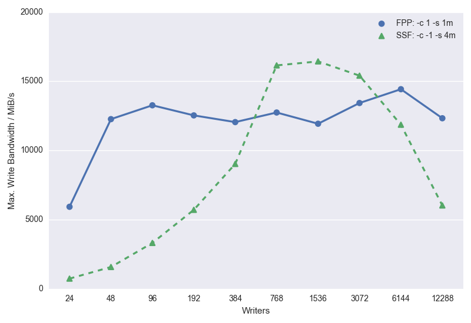

Tuning Parallel I/O on ARCHER
=============================

This section provides information on getting the best performance
out of the parallel `/work` file systems on ARCHER when writing
data.

Types of parallel I/O
---------------------

There are a number of different types of I/O that could be considered
but we have limited ourselves to providing information for _write_
performance in the following cases:

_File Per Process (FPP)_
: One binary file written per parallel process. In this scenario we
  have investigated performance for standard unformatted Fortran
  writes. This scheme has the disadvantage that, at the end of the 
  calculation, the data is spread across many different files and
  may therefore be difficult to use for further analysis without 
  a data reconstruction stage.

_Single Shared File (SSF)_
: One binary file written to collectively by all parallel processes.
  In this scenario we have investigated performance using MPI-IO,
  parallel NetCDF, and parallel HDF5. Shared-file I/O has the advantage
  that all the data is organised correctly in a single file making 
  analysis or restart more straightforward.

We have only considered write performance in the first instance as
this is usually the critical factor for performance in parallel modelling or
simulation applications.

__Note:__ We have not yet included the NetCDF or HDF5 data below
but will add this shortly.

Lustre parallel file system parameters
--------------------------------------

The ARCHER `/work` file systems use the Lustre parallel file system
technology. On Lustre, users have control of a number of settings
on a per-file basis including the _striping settings_. Although these
parameters can be set on a per-file basis they are usually set on 
directory where your output files will be written so that all output
files inherit the settings.

Stripe settings for a directory (or file) can be set using the
`lfs setstripe` command.

You can query the stripe settings for a directory (or file) using the
`lfs getstripe` command.

Setting the striping parameters correcty is a key part of getting the
best write performance for your application on Lustre.
There are two parameters that you need to be concerned with: _stripe 
count_ and _stripe size_.  Generally, the stripe count has a larger
impact on performance than the stripe size.


### Stripe Count
The stripe count sets the number of OSTs (Object Storage Targets) that
Lustre stripes the file across. In theory, the larger the number
of stripes, the more parallel write performance is available. However,
large stripe counts for small files can be detrimental to performance
as there is an overhead to using more stripes.

Stripe count is set using the `-c` option to `lfs setstripe`. For example,
to set a stripe count of 1 for directory `res_dir` you would use:

```bash
auser@eslogin006:~> lfs setstripe -c 1 res_dir/
```

The special value '-1' to the stripe count tells Lustre to use maximum 
striping.

We have investigated stripe counts of __1__, __4__ (the default), and
__-1__ (maximum striping).

__FPP Note:__ Using multiple stripes with large numbers of files (for example
in a FPP scheme with large core counts) can cause problems for the 
file system causing your jobs to fail and also may impact other users
in a large way. We strongly recommend that you use a stripe count of 
1 when using a FPP scheme.

__SSF Note:__ In contrast to the FPP scheme, to get best performance using
a SSF scheme you should use maximal striping (`-c -1`). In this case, this
does not cause issues for the file system as there are only a small number
of files open.

### Stripe Size
The size of each stripe generally has less of an impact on performance
than the stripe count but can become important as the size
of the file being written increases.

Stripe size is set using the  `-s` option to `lfs setstripe`. For example,
to set a stripe size of 4 MiB for directory `res_dir` along with 
maximum striping you would use:

```bash
auser@eslogin006:~> lfs setstripe -s 4m -c -1 res_dir/
```
Note that the `-s` option understands the following suffixes: 'k': KiB,
'm': MiB, 'g': GiB.

We have investigated stripe sizes of __1 MiB__ (the default), __4 MiB__,
and __8 MiB__.

ARCHER /work default stripe settings and OST counts
---------------------------------------------------

Each of the three Lustre `/work` file systems on ARCHER has the same
default stripe settings:

* A default stripe count of __4__
* A default stripe size of __1 MiB__

These settings have been chosen to provide a good compromise for the
wide variety of I/O patterns that are seen on the system but are 
unlikely to be optimal for any one particular scenario.

The total available number of OSTs available on each file system
are as follows:

* fs2: 48
* fs3: 48
* fs4: 56

### How can I find out which file system I am on?

All projects have their `/work` directory on one of the three Lustre
file systems. You can find out which one your project uses on ARCHER
by moving the your `/work` directory and using the `readlink` command:

```bash
auser@eslogin006:~> cd /work/t01/t01/auser
auser@eslogin006:/work/t01/t01/auser> readlink -f .
/fs3/t01/t01/auser
```

So project 't01' uses the 'fs3' Lustre file system.

Summary of performance advice
-----------------------------

Our tests show that the maximum bandwidth you can expect to obtain from
the ARCHER Lustre `/work` file systems in practice is __15-17 GiB/s__,
irrespective of whether you use a FPP or SSF approach (the theoretical 
maximum performance is 30 GiB/s for fs2 and fs3 and 35 GiB/s for 
fs4).

We provide detailed performance numbers for the different schemes below
and provide a high-level summary here.

* For most cases we would recommend that users use a FPP scheme as it 
  gives good, reliable performance for a wide range of process counts.
* When using FPP you should explictly set a stripe count of 1 (`-c 1`)
  as it provides excellent performance, minimises chances of job
  crashes, and has minimum impact on other users.
* When using SSF you should set maximum stripe count (`-c -1`) as this
  is required for performance.
* If you are using MPI-IO in a SSF scheme you must ensure that you are 
  using collective I/O to get good performance.
* The stripe size for SSF depends on the amount of data being written. The 
  larger the data being written, the larger the stripe size should be used.
  Please see the more detailed information provided below.

Plot comparing maximum achieved write bandwiths on ARCHER fs3 for FPP and
SSF parallel I/O schemes:

  
File Per Process (FPP)
----------------------

The data below show the maximum measured write bandwidths (in MiB/s) for the FPP
scheme using unformatted Fortran writes with different numbers of parallel processes.

These writes corresponded to:

* 1024 MiB written per process
* Fully-populated ARCHER nodes (24 processes per node)

A large amount of data needs to be written by each process to make sure that the
aggressive caching and buffering of I/O by the Fortran I/O library is avoided.

In summary:

* Using FPP we can quickly get high levels of performance for
the ARCHER Lustre file systems (just 2 nodes, 48 processes, can give a write performance in excess
of 12 GiB/s)

Plot of write bandwidth distributions for ARCHER fs3 using the FPP scheme:


| Number of Processes | Stripe Count | Stripe Size (MiB) | Max. Write Bandwidth (MiB) |
| ------------------: | -----------: | ----------------: | -------------------------: |
|                  24 |            1 |                 1 |                      5929  |
|                  48 |            1 |                 1 |                     12261  |
|                  96 |            1 |                 1 |                     13262  |
|                 192 |            1 |                 1 |                     12532  |
|                 384 |            1 |                 1 |                     12048  |
|                 768 |            1 |                 1 |                     12741  |
|                1536 |            1 |                 1 |                     11930  |

Single Shared File (SSF)
------------------------

### MPI-IO

The data below show the maximum measured write bandwidths (in MiB/s) for the SSF
scheme using MPI-IO collective writes with different numbers of parallel processes.
These writes corresponded to:

* 16 MiB written per process
* Fully-populated ARCHER nodes (24 processes per node)

Less data is required per process in the SSF scheme compared to the FPP scheme as 
MPI-IO does not employ the agressive buffering seen in the Fortran
I/O library.

In summary:

* Below 96 processes the defaut stripe count of 4 gives the best performance
* Above 96 processes maximal striping (`-c -1`) should be used to get best performance
* MPI-IO collective operations are required to see good performance
* Single striping (`-c 1`) was not explored in detail as the performance was so low
  that it made running large tests problematic.

A more detailed study of the performance of SSF schemes can be found in the 
ARCHER White Paper:
[Performance of Parallel IO on ARCHER](http://www.archer.ac.uk/documentation/white-papers/parallelIO/ARCHER_wp_parallelIO.pdf)

Plot of write bandwidth distributions for ARCHER fs3 using the SSF scheme:


| Number of Processes | Stripe Count | Stripe Size (MiB) | Max. Write Bandwidth (MiB) |
| ------------------: | -----------: | ----------------: | -------------------------: |
|                  24 |           -1 |                 1 |                       662  |
|                  48 |           -1 |                 1 |                      1311  |
|                  96 |           -1 |                 1 |                      2270  |
|                 192 |           -1 |                 1 |                      3791  |
|                 384 |           -1 |                 1 |                      5396  |
|                 768 |           -1 |                 1 |                      5775  |
|                1536 |           -1 |                 1 |                      5945  |
|                3072 |           -1 |                 1 |                     11321  |
|                6144 |           -1 |                 1 |                     11530  |
|               12288 |           -1 |                 1 |                      6368  |

| Number of Processes | Stripe Count | Stripe Size (MiB) | Max. Write Bandwidth (MiB) |
| ------------------: | -----------: | ----------------: | -------------------------: |
|                  24 |           -1 |                 8 |                       691  |
|                  48 |           -1 |                 8 |                      1487  |
|                  96 |           -1 |                 8 |                      3085  |
|                 192 |           -1 |                 8 |                      5587  |
|                 384 |           -1 |                 8 |                      7663  |
|                 768 |           -1 |                 8 |                      9108  |
|                1536 |           -1 |                 8 |                      8599  |
|                3072 |           -1 |                 8 |                     13785  |
|                6144 |           -1 |                 8 |                     15946  |
|               12288 |           -1 |                 8 |                      8205  |

| Number of Processes | Stripe Count | Stripe Size (MiB) | Max. Write Bandwidth (MiB) |
| ------------------: | -----------: | ----------------: | -------------------------: |
|                  24 |            4 |                 1 |                       862  |
|                  48 |            4 |                 1 |                      1313  |
|                  96 |            4 |                 1 |                      1292  |
|                 192 |            4 |                 1 |                      1585  |
|                 384 |            4 |                 1 |                       881  |
|                 768 |            4 |                 1 |                       924  |
|                1536 |            4 |                 1 |                       822  |
|                3072 |            4 |                 1 |                      1288  |
|                6144 |            4 |                 1 |                       946  |

| Number of Processes | Stripe Count | Stripe Size (MiB) | Max. Write Bandwidth (MiB) |
| ------------------: | -----------: | ----------------: | -------------------------: |
|                  24 |            4 |                 8 |                       915  |
|                  48 |            4 |                 8 |                      1565  |
|                  96 |            4 |                 8 |                      1789  |
|                 192 |            4 |                 8 |                      1753  |
|                 384 |            4 |                 8 |                      1251  |
|                 768 |            4 |                 8 |                      1553  |
|                1536 |            4 |                 8 |                      1355  |
|                3072 |            4 |                 8 |                      1650  |
|                6144 |            4 |                 8 |                      1939  |

